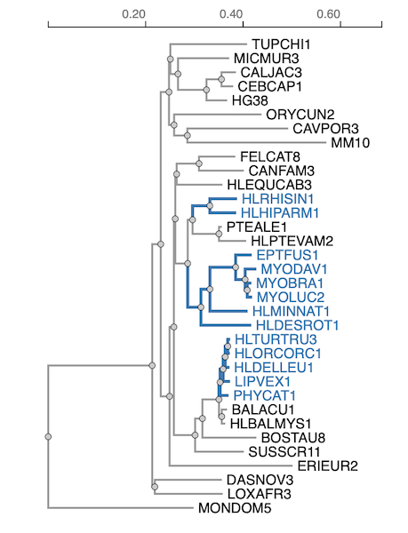

# BUSTED-PH: Gene-wide detection of trait-associated positive selection

## Overview
BUSTED-PH (Branch-Site Unrestricted Statistical Test for Episodic Diversification - Phenotype) is a statistical method designed to identify genes where episodic diversifying selection (EDS) is associated with a binary trait (phenotype). It is particularly useful for detecting signals of convergent evolution where multiple independent lineages (species or clades) share a phenotype.

The method explicitly models and contrasts positive selection across two sets of branches in a phylogenetic tree:
1.  **Foreground (FG)**: Branches associated with the phenotype of interest.
2.  **Background (BG)**: Branches not associated with the phenotype.

BUSTED-PH performs three distinct statistical tests to ensure that the detected selection is specific to the trait:
1.  **Test for Selection on FG**: Is there evidence of positive selection ($\omega > 1$) on the foreground branches?
2.  **Test for Selection on BG**: Is there evidence of positive selection on the background branches?
3.  **Test for Difference**: Is the selective regime (distribution of $\omega$ rates) significantly different between FG and BG branches?

Trait-associated positive selection is inferred when there is significant selection on FG, no significant selection on BG, and a significant difference between the two.

## Citation
If you use BUSTED-PH, please cite:

**BUSTED-PH: Gene-wide detection of trait-associated positive selection**
Avery Selberg, Nathan Clark, Maria Chikina, Sergei L Kosakovsky Pond.
*Manuscript in preparation/review.*

## Input Requirements
To run BUSTED-PH, you need:

1.  **Sequence Alignment**: A codon-aware multiple sequence alignment (e.g., FASTA, NEXUS, PHYLIP).
    *   Stop codons must be removed or stripped.
    *   The alignment should be in frame.
2.  **Phylogenetic Tree**: A tree corresponding to the alignment.
    *   The tree must have branches partitioned into **Foreground** (phenotype present) and **Background** (phenotype absent).
    *   This is typically done by labeling the tree string (e.g., `{FG}` tags) or using an annotation file.

    **Example of a Labeled Tree**:
    

## Usage
BUSTED-PH is implemented in HyPhy (version 2.5.73 or later).

### Command Line Interface
```bash
hyphy busted-ph --alignment path/to/alignment.fasta --tree path/to/tree.nwk --branches ForegroundLabel [options]
```

### Key Arguments
| Argument | Description | Default |
| :--- | :--- | :--- |
| `--alignment` | Path to the codon alignment file. | Required |
| `--tree` | Path to the phylogenetic tree file (if not included in alignment). | Derived from alignment if omitted |
| `--branches` | The label in the tree file denoting the Foreground branches. | Required |
| `--rates` | Number of rate classes (k). The paper suggests k=2 or k=3. | 3 |
| `--error-sink` | Enable BUSTED-E style error mitigation (Yes/No). Useful for noisy alignments. | No |
| `--srv` | Enable Synonymous Rate Variation (Yes/No). | Yes |

## Outputs
BUSTED-PH produces a JSON file containing the detailed results of the model fits and hypothesis tests.

### Standard Output
The console will print the progress of the likelihood optimization and a summary of the three likelihood ratio tests (LRTs).

### JSON Output
The primary output is a JSON file (usually named `[alignment].json` or `[alignment].BUSTED.json`).

*   **`BUSTED-PH`**: The high-level summary of the phenotype association tests.
    *   `Corrected P-value`: P-values adjusted for multiple testing (if applicable).
    *   `Uncorrected P-value`: Raw p-values for the three tests (`FG`, `BG`, `Comparative` (Difference)).
    *   `Summary`: A text summary of the conclusion (e.g., "Selection is associated with the phenotype / trait").
*   **`fits`**: Detailed parameter estimates for the different models.
    *   `Unconstrained model`: The full model where FG and BG have independent rate distributions. Look here for the inferred $\omega$ values (`Rate Distributions`).
    *   `Constrained model`: The null model for the selection tests.
    *   `Same distributions model`: The null model for the difference test (FG and BG share distributions).

## Interpretation
A gene is considered to exhibit **trait-associated episodic diversifying selection (EDS)** if it meets the following criteria:

1.  **Selection on FG**: Significant p-value ($p < 0.05$) for the FG test.
2.  **No Selection on BG**: Non-significant p-value ($p > 0.05$) for the BG test.
3.  **Significant Difference**: Significant p-value ($p < 0.05$) for the Difference (`Comparative`) test.

**Note**: The "Difference" test is crucial to rule out genes that are under selection across the entire tree (not just the trait lineages).

## LLM-Targeted Information

### Analysis Prompt Template
Use the following prompt to ask an LLM to interpret your BUSTED-PH JSON results:

> "I ran the BUSTED-PH analysis on my dataset to detect positive selection associated with [Trait Name].
>
> Here are the key results from the JSON output:
> - **Test for Selection on Foreground (FG)**: p-value = [Insert `BUSTED-PH.Uncorrected P-value.FG`]
> - **Test for Selection on Background (BG)**: p-value = [Insert `BUSTED-PH.Uncorrected P-value.BG`]
> - **Test for Difference (Comparative)**: p-value = [Insert `BUSTED-PH.Uncorrected P-value.Comparative`]
>
> **Foreground Rate Distribution (from `fits.Unconstrained model.Rate Distributions.Test`)**:
> [Paste the `Test` rate distribution block here]
>
> **Background Rate Distribution (from `fits.Unconstrained model.Rate Distributions.Background`)**:
> [Paste the `Background` rate distribution block here]
>
> Based on these results, is there evidence for trait-associated positive selection? Explain if the selection is specific to the trait or widespread."

### JSON Field Descriptions
*   `BUSTED-PH.Uncorrected P-value.FG`: P-value testing if there is positive selection (omega > 1) specifically on the foreground branches.
*   `BUSTED-PH.Uncorrected P-value.BG`: P-value testing if there is positive selection on the background branches.
*   `BUSTED-PH.Uncorrected P-value.Comparative`: P-value testing if the selective regimes (omega distributions) are statistically different between foreground and background.
*   `fits.Unconstrained model.Rate Distributions.Test`: The inferred distribution of omega rates and their weights for the foreground branches. High weights on omega > 1 indicate positive selection.
*   `fits.Unconstrained model.Rate Distributions.Background`: The inferred distribution of omega rates for the background branches.

## Example Data
### Input
- **Alignment**: `data/prestin.nex` (Contains alignment and tree labeled with `{ECHOLOCATORS}`)

### Output Summary (Example)
Running BUSTED-PH on `prestin.nex` with `{ECHOLOCATORS}` as foreground:

*   **Test for Selection on FG**: p = 0.0168 (Significant)
*   **Test for Selection on BG**: p = 0.5000 (Not significant)
*   **Test for Difference**: p < 0.0001 (Significant)
*   **Conclusion**: "Selection is associated with the phenotype / trait"

This indicates that the *Prestin* gene is under positive selection specifically in the echolocating lineages, supporting the hypothesis of convergent evolution for echolocation.